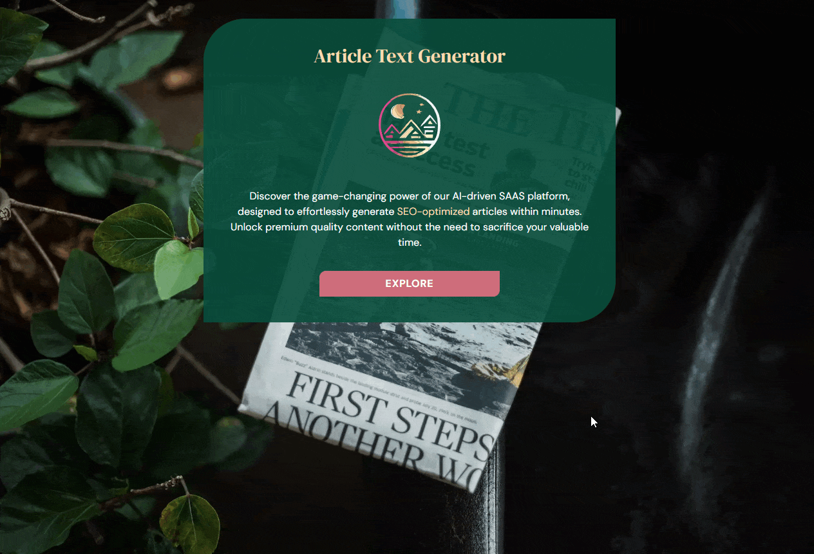

# Article generator 

This project emerged from my curiosity to explore ChatGPT and build a similar system focused on generating articles.



### Built with

- Next.js
- Context and reducer
- Stripe
- MongoDB
- Auth0
- OpenAI
- TailwindCSS

### Features

**Authentication**:  In order to use the service, users are required to be 
logged in. Authentication is implemented with Auth0.

**Generate article**: When a user has enough tokens, they can access 
`/article/new` by clicking on the NEW POST button. This page displays a form where users can enter the desired subject and keywords to generate an SEO-friendly article.

**Tokens**:  Generating an article consumes 5 tokens. If a user does not have enough tokens, they will be unable to navigate to `/article/new` and will be redirected to `/token` where they can purchase more tokens.

**Payment**: Payment functionality is implemented using Stripe, which provides a secure and user-friendly way for customers to pay for their orders. When a `payment_intent.succeeded` event is triggered, 10 tokens will be added to the user's account.

**Storage**: Articles and user information, including their tokens, are stored in MongoDB.

**Article preview**: Users can preview only the articles they have generated. The preview includes the title, a short description, chosen keywords, and the article content. In the sidebar, a list of the user's generated articles will be displayed for them to choose from.

**Delete article**:  Users can delete the article they are currently viewing by clicking the trash icon next to its title in the sidebar.

**State**: By default, the first 5 articles are loaded. Users have the option to load 5 more articles by clicking the "load more" button. This process can be repeated until there are no more articles to show, at which point the "load more" button will disappear. These states are managed using context and reducer. The available actions include `SET_INITIAL_ARTICLES`, `GET_MORE_ARTICLES`, `ADD_NEW_ARTICLE`, and `DELETE_ARTICLES.`

## Installation

Clone the repository and run `npm install`.

You'll need to create `env.local` and to include the following environment 
variables:

```dotenv
OPENAI_API_KEY=
AUTH0_SECRET=
AUTH0_BASE_URL=http://localhost:3000
AUTH0_ISSUER_BASE_URL=
AUTH0_CLIENT_ID=
AUTH0_CLIENT_SECRET=
MONGODB_URI=
NEXT_PUBLIC_STRIPE_PUBLISHABLE_KEY=
STRIPE_SECRET_KEY=
STRIPE_PRODUCT_PRICE_ID=
STRIPE_WEBHOOK_SECRET=
```

`npm run dev` to start a server
